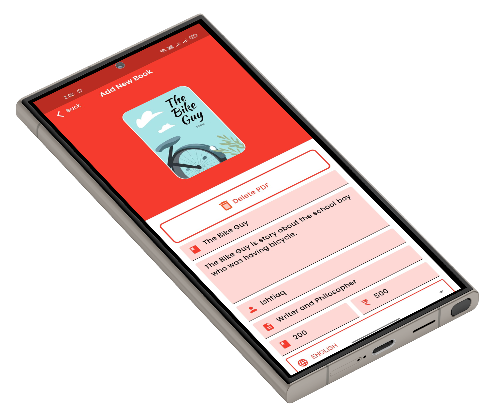

# 📚 E-Library App – Flutter + Firebase

A powerful and modern mobile E-Library app built with Flutter and Firebase.  
Users can read, upload, and download books — all in one clean and elegant interface.

---

## 🚀 Features

- 🔐 Firebase Authentication (Email/Password & Google Sign-In)
- 📤 Upload PDF Books with Title, Author, Description, and Cover Image
- 📖 Read PDFs using in-app viewer (Syncfusion)
- ⬇️ Download Books to Device Storage
- 🧠 Manage Personal Books
- 🎯 Clean & Modern UI/UX
- 🧱 Built using Flutter + GetX + Firebase

---
## 📱 App Screens – E-Library UI Mockups

> A smooth staircase-like preview of the **E-Library app**’s intuitive and modern UI screens.

 

<table>
  <tr>
    <td align="left" width="33%">
      
    </td>
    <td></td>
    <td></td>
  </tr>
  <tr>
    <td></td>
    <td align="center">
      
    </td>
    <td></td>
  </tr>
  <tr>
    <td></td>
    <td></td>
    <td align="right">
      
    </td>
  </tr>
  <tr>
    <td></td>
    <td></td>
    <td align="right">
      
    </td>
  </tr>
</table>

 

  <i>✨ Dive into a smooth, elegant, and intuitive reading experience with the E-Library app.</i>

<!-- ## 📸 App Screens – Mockups

A glimpse into the E-Library app's modern UI/UX experience across various screens:

 -->

<!-- ## 📸 Screenshots

| Login | Home | Read Book | Upload Book |
|------|------|-----------|--------------|
|  |  |  |  |  | | -->

---
<!-- 
## 🎥 Demo Video

> Replace `YOUR_VIDEO_ID` with your YouTube video ID if available. -->

<!-- --- -->

## 📦 Tech Stack

- **Flutter** – UI development
- **Dart** – Programming language
- **GetX** – State management
- **Firebase** – Authentication, Firestore, Storage
- **Syncfusion** – In-app PDF viewer
- **VS Code** – Development environment

---

## 📂 Folder Structure (Core)

<!-- # e_library

A new Flutter project.

## Getting Started

This project is a starting point for a Flutter application.

A few resources to get you started if this is your first Flutter project:

- [Lab: Write your first Flutter app](https://docs.flutter.dev/get-started/codelab)
- [Cookbook: Useful Flutter samples](https://docs.flutter.dev/cookbook)

For help getting started with Flutter development, view the
[online documentation](https://docs.flutter.dev/), which offers tutorials,
samples, guidance on mobile development, and a full API reference. -->
